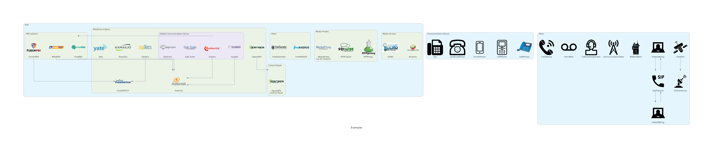

# Telephony Diagrams

## Examples

## How to use?

Just copy `telephony.py` and `resources` folder to your project and you can use it.

## Billing solutions

- [A2Billing](https://github.com/Star2Billing/a2billing)
- [MagnusBilling](https://github.com/magnussolution/magnusbilling7)
- [cgrates](https://github.com/cgrates/cgrates)
- [ASTPP](https://github.com/iNextrix/ASTPP)
